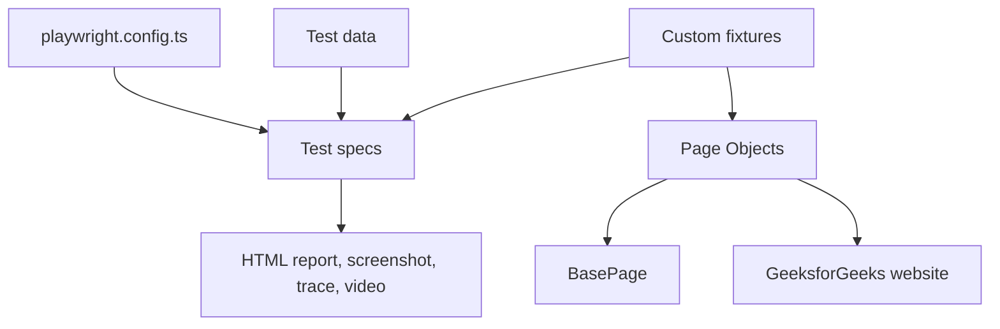
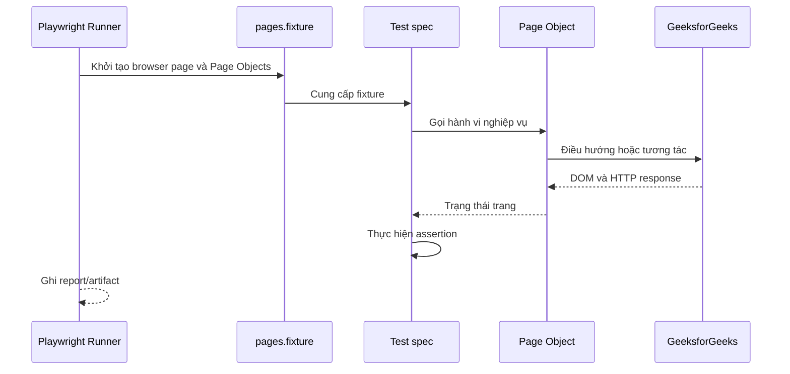

# Kiến trúc bộ kiểm thử GeeksforGeeks

## 1. Tổng quan

Project sử dụng Playwright Test và TypeScript để kiểm thử các chức năng công
khai cơ bản của GeeksforGeeks trên Chromium desktop.

Kiến trúc được chia thành bốn tầng:



- **Configuration:** thiết lập browser, timeout, reporter và artifact.
- **Test specs:** mô tả kịch bản và kết quả mong đợi.
- **Fixtures:** khởi tạo Page Object cho từng test.
- **Page Objects:** đóng gói locator và thao tác với từng khu vực website.

## 2. Cấu trúc thư mục

```text
gfg-playwright-test/
|-- playwright.config.ts
|-- package.json
|-- tests/
|   |-- fixtures/
|   |   |-- pages.fixture.ts
|   |   `-- test-data.ts
|   |-- pages/
|   |   |-- base.page.ts
|   |   |-- home.page.ts
|   |   |-- search.page.ts
|   |   |-- article.page.ts
|   |   |-- practice.page.ts
|   |   |-- courses.page.ts
|   |   `-- auth.page.ts
|   |-- smoke/
|   |   |-- homepage.spec.ts
|   |   `-- navigation.spec.ts
|   `-- functional/
|       |-- article.spec.ts
|       |-- authentication.spec.ts
|       |-- courses.spec.ts
|       |-- practice.spec.ts
|       `-- search.spec.ts
|-- ARCHITECTURE.md
`-- USAGE.md
```

## 3. Trách nhiệm các thành phần

### Cấu hình Playwright

`playwright.config.ts` là điểm cấu hình trung tâm:

- `baseURL` mặc định là `https://www.geeksforgeeks.org`.
- Chạy bằng Chromium với cấu hình Desktop Chrome.
- Mỗi test có timeout 45 giây.
- Assertion có timeout 10 giây.
- CI retry hai lần và chạy một worker.
- Máy local chạy tối đa bốn worker để hạn chế tải đồng thời lên website
  production.
- Sinh HTML report.
- Chụp screenshot khi test thất bại.
- Thu trace và video ở lần retry đầu.

### Test specs

Test chỉ nên chứa:

1. Chuẩn bị dữ liệu hoặc điều kiện test.
2. Gọi hành vi từ Page Object.
3. Assertion ở mức nghiệp vụ.

Các nhóm test hiện có:

- `@smoke`: trang chủ và điều hướng quan trọng.
- `@functional`: search, article, Practice, Courses và validation đăng nhập.
- `@account`: đăng nhập thật, quên mật khẩu và đăng ký tới bước OTP.

### Page Objects

Mỗi Page Object đại diện cho một khu vực nghiệp vụ:

- `BasePage`: điều hướng, kiểm tra HTTP response, đóng popup và phát hiện trang
  lỗi.
- `HomePage`: trang chủ, header, tìm kiếm và điều hướng chính.
- `SearchPage`: danh sách và mở kết quả tìm kiếm.
- `ArticlePage`: nội dung bài viết, code block và liên kết nội bộ.
- `PracticePage`: danh sách và tìm kiếm bài tập.
- `CoursesPage`: danh sách và trang chi tiết khóa học.
- `AuthPage`: modal đăng nhập, validation, đăng ký và khôi phục mật khẩu.

Locator được ưu tiên theo thứ tự:

1. Role và accessible name.
2. Label hoặc placeholder.
3. Thuộc tính HTML ổn định.
4. CSS selector giới hạn trong container cụ thể.

Không phụ thuộc vào class sinh động, quảng cáo, số lượt xem hoặc thứ tự nội
dung có thể thay đổi.

### Fixtures và dữ liệu

`pages.fixture.ts` mở rộng fixture mặc định của Playwright để cung cấp sẵn các
Page Object cho test.

`test-data.ts` chứa dữ liệu dùng chung như từ khóa tìm kiếm và tên bài tập.
Thông tin bí mật không được đặt trong file này; credentials phải lấy từ biến
môi trường.

## 4. Luồng thực thi



Test `@account` chạy tuần tự với một worker để giảm xung đột session và giới
hạn nguy cơ rate limit. Test đăng ký và khôi phục mật khẩu dừng tại OTP; project
không vượt CAPTCHA và không tự động thay đổi mật khẩu.

## 5. Mở rộng bộ test

Khi thêm một chức năng mới:

1. Tạo hoặc mở rộng Page Object trong `tests/pages`.
2. Đưa dữ liệu dùng chung vào `tests/fixtures/test-data.ts`.
3. Thêm spec vào `smoke` hoặc `functional`.
4. Gắn tag phù hợp trong tên `describe`.
5. Ưu tiên web-first assertion như `toBeVisible` và `toHaveURL`.
6. Chạy test mới riêng trước khi chạy toàn suite.

Không thêm thao tác thanh toán, submit bài, vượt OTP/CAPTCHA hoặc thay đổi dữ
liệu production nếu chưa có môi trường và tài khoản test riêng.
